# OCRC

[toc]

## 引言 Introduction

**OCRC** 全称为 *Optical Character Recognition Commander*，中文为**光学字符识别指挥**，是一个集全了*百度 OCR* 与 *Mathpix OCR*的**文字+公式**识别利器。

## 下载 Download

暂不准备 Release，如有需要可自行 Clone 代码。下面是必须的文件。

`OCRC.ahk` 主程序

`lib/Common.ahk` 调用函数集合

`lib/JSON.ahk` JSON 库

`lib/Baidu.ahk` Baidu 类

`lib/Mathpix.ahk` Mathpix 类

`icon/OCRC_icon.ico` 图标

## 使用说明 Instruction

OCRC 的使用需要联网，无法离线使用。

> **注意**：下列使用说明基于版本 **[1.1.3]**

[1.1.3]: https://github.com/pilgrimlyieu/AutoHotkey-Script/tree/6fad68c91400bb455f2273b6a5adec67eb1e20cb/OCRC

### 菜单 Menu


如图所示这个可爱的小相机就是 OCRC 的图标，右键会出现三个选项：设置（粗体）、重启和退出。顾名思义，不再解释。


### 设置 Setting

#### 百度 OCR

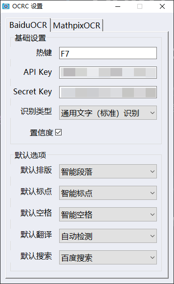

如图所示是*百度 OCR* 默认设置界面（API Key 与 Secret Key 部分是空的）。

**热键**

可以自定义热键。使用方法即为点击热键编辑框，并输入指定热键即可。（默认是 <kbd>F7</kbd>）

应有几点需要注意的：

1. 文本识别与公式识别热键不应相同（并没有对此做出限制，但确实不应该这样做）
2. 不支持鼠标/游戏杆热键或 <kbd>Win</kbd> 键[^UnsupportHotkey]

---

**API Key & Secret Key**

这是百度 OCR API 的相关信息，具体详见[文字识别 OCR - 新手操作指引](https://cloud.baidu.com/doc/OCR/s/dk3iqnq51)或百度关键词「百度 OCR API 申请」进行申请。截至 2022-04-04（即撰稿日），新用户可领取如下调用福利。

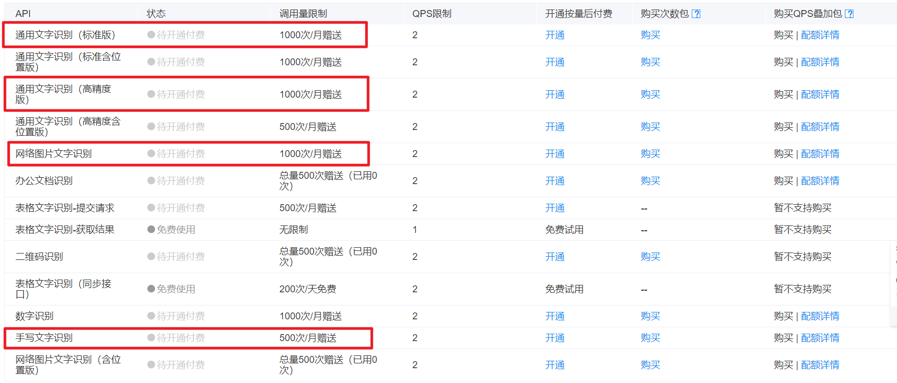

> 插嘴一句，一两年前这个数量分别是 50000次/天 和 500次/天（标准和高精度），远高于现在领取的，所以说领的越早越好。另外，我领的是 1000次/月，虽然够用，但还是痛心。

依照上面指示获取到 API Key 与 Secret Key 后填入设置即可。需要注意的是，这两个信息需要严格保密。

> 另外，还支持使用 Token 来调用 OCR 结果。假如你并不想自己申请的话，可以与别人共用，他可以给你他的 Token（Token 是发送给百度 OCR 的认证字串，有效期 30 天），而不用跟你共用 API Key 与 Secret Key 信息。并填写到配置文件中的 `Baidu_Token` 中（不支持在设置中填写，防止误操作，详见[配置文件介绍](#配置文件-config)）。

---

**识别类型**

支持的识别类型包括*通用文字（标准）识别*、*通用文字（高精度）识别*、*手写文字识别*、*网络图片识别*。除了*手写文字识别*是 500次/月 外其他都是 1000次/月。

我的建议是全部都用*高精度识别*。经过不完全的测试，对于手写文字，*手写文字识别*与*高精度识别*不相上下，而*标准识别*一塌糊涂，而*高精度识别*一般来说次数够用，因此更推荐使用*高精度识别*。（默认是第一个，下同）

---

**置信度**

选择返回置信度结果的类型。

*精确*置信度：


会返回精确的置信度。

*粗糙*置信度：


会返回粗糙的置信度。

*关闭*置信度：


不会返回置信度。

> 需要注意的是，精确置信度与粗糙置信度的区别应该不超过 1% ，因此不必纠结选择哪种置信度，它们的区别仅仅在于实现方式的不同。详细请看下面「精确置信度与粗糙置信度的区别」。

<Details><Summary>精确置信度与粗糙置信度的区别</Summary>

根据[ API 文档](https://cloud.baidu.com/doc/OCR/s/1k3h7y3db)介绍，返回的结果是每行的置信度，因此我们有两种选择来计算总置信度：
1. 将每行的置信度乘以该行所含字符个数作为权重进行累加，最后除以总结果的字符个数。即为*精确置信度*。
2. 每行置信度累加除以行数。即为*粗糙置信度*。

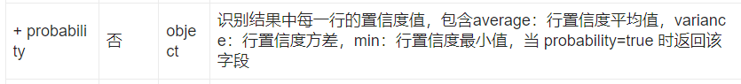

它们的实现过程在 `Baidu.ahk` 中 `Baidu` 类的 `Prob` 函数

```autohotkey
Prob() {
    if (this.config.probtype = 1) {
        for index, value in this.json.words_result
            probadd += value.probability.average * StrLen(value.words)
        this.probability := Format("{:.2f}", 100 * probadd / StrLen(this.result))
    }
    else {
        for index, value in this.json.words_result
            probadd += value.probability.average
        this.probability := Format("{:.2f}", 100 * probadd / this.json.words_result_num)
    }
}
```

`Prob` 函数计算置信度，`this.config.probtype` 代表置信度类型—— `1` 代表精确置信度，`-1` 代表粗糙置信度，`0` 代表关闭置信度—— `this.probability` 代表置信度结果。

实际上精确置信度也并不精确，因为返回结果经过了处理，可能增加了字符或减少了字符导致结果的误差。因此置信度类型的选择无关紧要——只要开启了就好。

</Details>

---

**默认排版**

如下图，默认排版包含了*智能段落*、*合并多行*和*拆分多行*等选项。

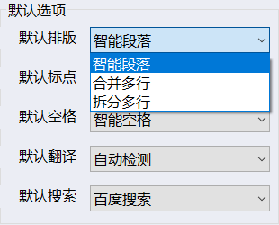

顾名思义，*智能段落*会智能识别多行文字的段落归属；*合并多行*会将多行结果合并为一行；而*拆分多行*会使每行结果独立。

由于 API 提供了返回段落数据的选项，我就没有自己去做智能段落合并。可能会有一些小问题，但是聊胜于无了。

---

**默认标点**

如下图，默认标点包含了*智能标点*、*原始结果*、*中文标点*、*英文标点*等选项。

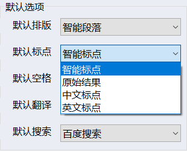

同样的，*智能标点*根据前后文信息智能地替换标点符号；*原始结果*比较复杂，稍后解释；*中文标点*将所有标点替换成中文标点；*英文标点*则相反。（省略号等特殊标点不包括在内）

中英标点转换详细内容见 `OCRC.ahk` 主程序中的全局变量 `C2EPuncs` 和 `E2CPuncs`

```autohotkey
Global C2EPuncs := {"，": ",", "。": ".", "？": "?", "！": "!", "、": ",", "：": ":", "；": ";", "“": """", "”": """", "‘": "'", "’": "'", "「": """", "」": """", "『": "'", "』": "'", "（": "(", "）": ")", "【": "[", "】": "]", "《": "", "》": ""}
Global E2CPuncs := {",": "，", ".": "。", "?": "？", "!": "！", ":": "：", ";": "；", "(": "（", ")": "）", "[": "【", "]": "】"}
```

由于*智能标点*引擎是我自己写的，有很多不足之处，[例如](https://github.com/pilgrimlyieu/AutoHotkey-Script/commit/e5cf1d1f6c510758951dc6234e970753854ee9d5)这个 commit 下的评论：

> Though, the intelligent punctuation engine is simple and not available for all cases. For example, `这里有 apple, banana, 笔, 橡皮和纸` should be `这里有 apple、banana、笔、橡皮和纸` instead of `这里有 apple, banana, 笔，橡皮和纸`.

<Details><Summary>智能标点引擎</Summary>

```autohotkey
if (puncstyle = 1) {
    for c, e in C2EPuncs
        result := RegExReplace(result, (c ~= "[“‘「『（【《]") ? c IsEnglishAfter : IsEnglishBefore c, e)
    for e, c in E2CPuncs
        result := RegExReplace(result, (e ~= "[([]") ? ((e ~= "[.?()[\]]") ? "\" e : e) IsChineseAfter : IsChineseBefore ((e ~= "[.?()[\]]") ? "\" e : e), c)
    QPNumP := 1, QPNum := 1
    loop parse, result
    {
        if (A_LoopField = """" and (SubStr(result, A_Index - 1, 1) ~= IsChinese or A_Index = 1) and (SubStr(result, A_Index + 1, 1) ~= IsChinese or A_Index = StrLen(result)))
            PTR .= Mod(QPNumP ++, 2) ? "“" : "”"
        else if (A_LoopField = "'" and (SubStr(result, A_Index - 1, 1) ~= IsChinese or A_Index = 1) and (SubStr(result, A_Index + 1, 1) ~= IsChinese or A_Index = StrLen(result)))
            PTR .= Mod(QPNum ++, 2) ? "‘" : "’"
        else
            PTR .= A_LoopField
    }
    result := PTR
}
```

</Details>

---

**默认空格**

如下图，默认空格包含了*智能空格*、*原始结果*、*去除空格*等选项。

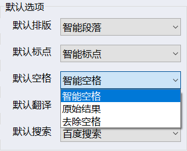

*智能空格*即为根据前后文信息在适当位置添加空格；*去除空格*即为去除结果中所有空格。

下面解释一下*原始结果*：

根据源码 `Baidu.ahk` 中 `Baidu` 类（`Format` 函数是排版函数；`Punc` 函数是标点函数，`Space` 函数是空格函数）

```autohotkey
Format(hwnd := "") {
    ...
	this.resulttemp := result
    ...
}

Punc(hwnd := "") {
    ...
    else if (puncstyle = 2)
        result := this.resultspacetemp ? this.resultspacetemp : this.resulttemp
    ...
	this.resultpunctemp := result
    ...
}

Space(hwnd := "") {
    ...
    else if (spacestyle = 2)
        result := this.resultpunctemp ? this.resultpunctemp : this.resulttemp
    ...
    this.resultspacetemp := result
    ...
}
```

我们可以发现 `Format`、`Punc` 和 `Space` 在处理完后分别保存了一个临时结果 `this.resulttemp`、`this.resultpunctemp` 和 `this.resultspacetemp`，在我们选择*原始结果*的时候，分别跳转到对方的临时结果（即标点与空格相互跳转），除非在默认标点选择了原始结果时，此时空格的临时结果还没有保存，就会跳转到排版的临时结果。更多的内容会在[结果窗口]中介绍。

*智能空格*引擎引擎也是我自己写的，也有很多不足。

<Details><Summary>智能空格引擎</Summary>

```autohotkey
if (spacestyle = 1) {
    for c, e in C2EPuncs
        result := RegExReplace(result, " ?(" c ") ?", "$1")
    result := RegExReplace(result, "(?:[\x{4e00}-\x{9fa5}a-zA-Z])\K ?(\d[\d.:]*) ?(?=[\x{4e00}-\x{9fa5}a-zA-Z])", " $1 ")
    result := RegExReplace(result, "(?:[\x{4e00}-\x{9fa5}a-zA-Z])\K ?(\d[\d.:]*) ?(?![\x{4e00}-\x{9fa5}a-zA-Z])", " $1")
    result := RegExReplace(result, "(?<![\x{4e00}-\x{9fa5}a-zA-Z]) ?(\d[\d.:]*) ?(?=[\x{4e00}-\x{9fa5}a-zA-Z])", "$1 ")
    result := RegExReplace(result, "(?:[\x{4e00}-\x{9fa5}])\K ?([a-zA-Z][a-zA-Z-_]*) ?(?=[\x{4e00}-\x{9fa5}])", " $1 ")
    result := RegExReplace(result, "(?:[\x{4e00}-\x{9fa5}])\K ?([a-zA-Z][a-zA-Z-_]*) ?(?![\x{4e00}-\x{9fa5}])", " $1")
    result := RegExReplace(result, "(?<![\x{4e00}-\x{9fa5}]) ?([a-zA-Z][a-zA-Z-_]*) ?(?=[\x{4e00}-\x{9fa5}])", "$1 ")
    result := RegExReplace(result, "(?:[\w\d])\K ?([,.?!:;]) ?(?=[\w\d\x{4e00}-\x{9fa5}])", "$1 ")
    result := RegExReplace(result, "(?:[\w\d])?\K([([]) ?(?=[\w\d])?", "$1")
    result := RegExReplace(result, "(?:[\w\d])?\K ?([)\]])(?=[\w\d])?", "$1")
    result := RegExReplace(result, "(?:\d)\K ?([.:]) ?(?=\d)", "$1")
    loop parse, result, "
    {
        if Mod(A_Index, 2)
            PTR .= A_LoopField """"
        else
            PTR .= Trim(A_LoopField) """"
    }
    loop parse, PTR, '
    {
        if Mod(A_Index, 2)
            PTRP .= A_LoopField "'"
        else
            PTRP .= Trim(A_LoopField) "'"
    }
    result := SubStr(PTRP, 1, StrLen(PTRP) - 2)
}
```

</Details>

---

**默认翻译**

如下图，默认翻译包含了*自动检测*、*英⟹中*、*中⟹英*、*繁⟹简*和*日⟹中*等选项。

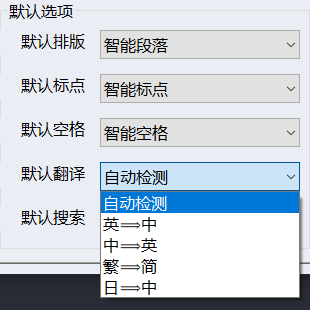

由于尚不支持翻译功能，此选项暂时无用。

---

**默认搜索**

如下图，默认搜索包含了*百度搜索*、*必应搜索*、*谷歌搜索*、*谷歌镜像*、*百度百科*、*维基镜像*和 *Everything* 等选项。

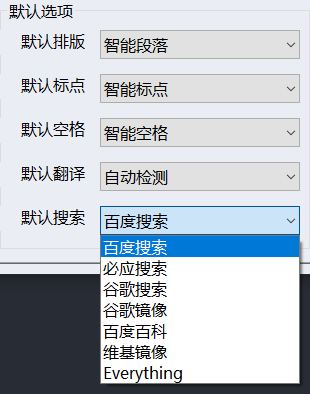

可以在结果窗口以结果为关键词进行搜索。Everything 的路径是 `D:/Program Files/Everything/Everything.exe`，以后可能会进行修改以支持自定义路径。

#### Mathpix OCR

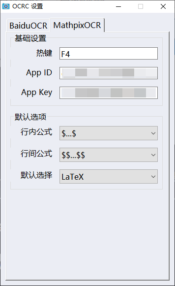

如图所示是 *Mathpix OCR* 默认设置界面（App ID 与 App Key 默认为空）

**热键**

[同上](#百度-ocr)

**App ID & App Key**

获取请百度关键词「Mathpix API 申请」，1000次/月，需要信用卡，超额会扣款（具体不清楚）。

然后一样的要填入，也一定要注意保密！

---

**行内公式**

如下图，行内公式包含了 `$...$` 与 `\(...\)` 等行内公式选项。

就是 `$\alpha$` 与 `\(\alpha\)` 的差别。

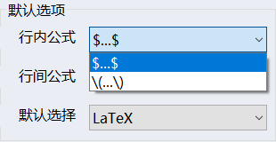

---

**行间公式**

如下图，行内公式包含了 `$$...$$` 与 `\[...\]` 等行间公式选项。

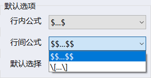

就是

```LaTeX
$$
\alpha
$$
```

与

```LaTeX
\[
\alpha
\]
```

的差别。

或许以后会加入 `equation`？但是由于现在我没使用，就没加入。

---

**默认选择**

如下图，默认选择包含 *LaTeX*、*行内公式*与*行间公式*。

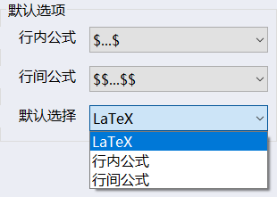

其含义为，在纯公式识别中默认复制的内容。

### 配置文件 Config

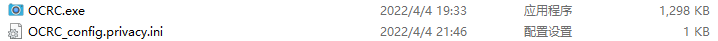

双击 `OCRC.exe` 以初始化配置文件。此时在同目录会出现文件 `OCRC_config.privacy.ini`，这就是配置文件。

> 别问为什么中间有个 `privacy`，问就是为了加入 `.gitignore` 防止信息泄露。后面可能会改。

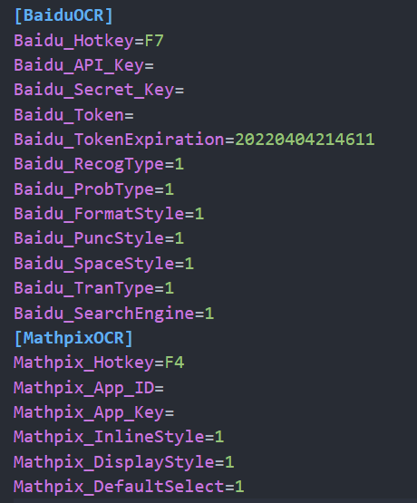

这就是初始配置了。（除了 `Baidu_TokenExpiration` 不同外其他应该都是相同的）

`Baidu_Hotkey` 与 `Mathpix_Hotkey` 是热键设置，也可以在此输入目标热键，输入格式见[ 热键修饰符](https://wyagd001.github.io/zh-cn/docs/Hotkeys.htm#Symbols)，例如 <kbd>Alt</kbd> + <kbd>A</kbd> 就是 `!a`（不要大写）。另外有一些文档列举了的特殊符号也用不了，如 `~`、`$` 等。

`Baidu_API_Key` & `Baidu_Secret_Key` [上面](#百度-ocr)解释过了。

`Mathpix_App_ID` & `Mathpix_App_Key` [上面](#mathpix-ocr)解释过了。

`Baidu_Token` 是 Token，如果你想通过 Token 来获取 OCR 结果，输入在这里就好了，同时还要修改 `Baidu_TokenExpiration`

`Baidu_TokenExpiration` 是 Token 过期时间，如果你想通过 Token 来获取 OCR 结果的话，就把这个数值调大一点（然而该过期时还是会过期的）。如果你是正常使用 API_Key 和 Secret_Key 的，就不要动这个值，因为程序根据这个值判断是否要更新 Token。默认值是配置文件创建时间。

剩下的除了 `Baidu_ProbType` [上面特别介绍](#百度-ocr)过了外，都是按照设置里的顺序从 1 开始排列的。就不一一解释了。

### 操作过程 Operation Process

截图软件使用 [Snipaste](https://www.snipaste.com)，暂不考虑其他截图方式。

同时 Snipaste 截图热键是 <kbd>F8</kbd>，暂时不考虑更改。（有需要更改的可以去 `Common.ahk` 中将 `GetScreenShot` 函数中的 `Send {f8}` 改为自己想要的热键，然后自行编译）

> 起初是自带截图，但是由于太卡了，极其影响体验，就去除了这个功能，详见[鸣谢](#鸣谢)

两个使用方法一致，按下指定热键会弹出截图窗口，截取所需内容后复制截图即可。另外设置的热键在软件启用时会覆盖这个热键的其他功能，所以请谨慎选择。

> **注意**：超过 10s 将会强制关闭截图，所以请不要超时。

### 结果窗口 Result Window

#### 百度 OCR

以 [澎湃新闻 - 拜登宣布史上最大规模抛储计划，油价会因此一路下跌吗？](https://www.thepaper.cn/newsDetail_forward_17454811)为例进行演示。

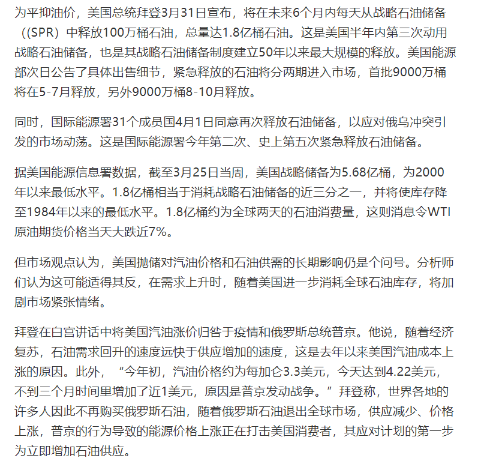

结果：

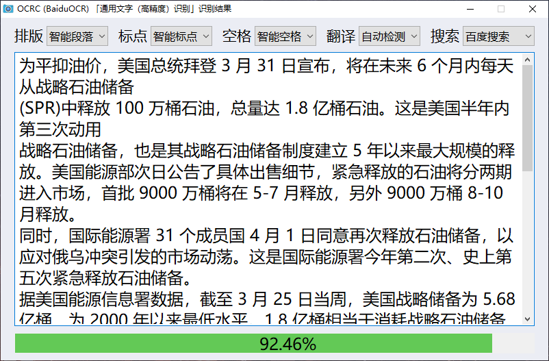

左上角显示了识别类型。上面一排显示了操作选项。最下面一条显示了置信度及其数值。

文字识别准确度还是挺高的。然而这个段落识别简直了。要不是看到第二段的「引发」我还以为出 bug 了。

---

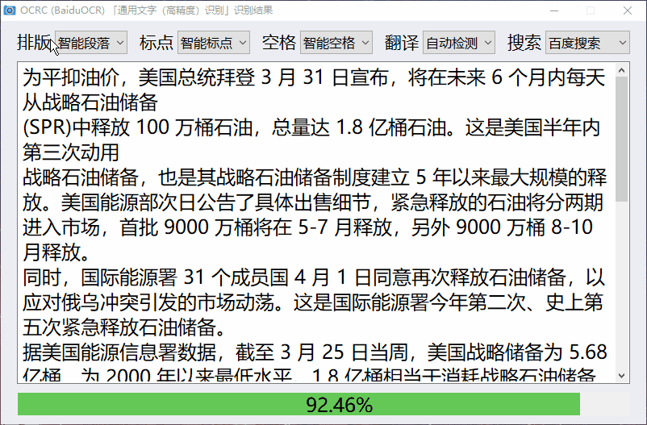

可以看出，排版*不基于*其它两项设置，实际上它直接修改 API 返回的文本，因此这会清除其它两项的修改。可以用此达到重置修改的目的。

---


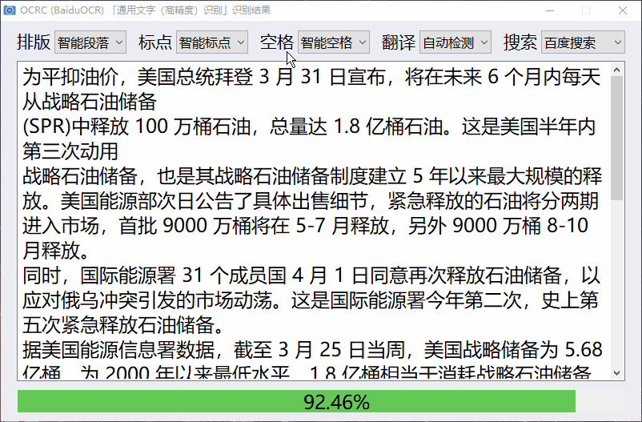


有点可惜的就是无法通过直接点击默认搜索引擎来实现直接搜索，而是仍要在打开的列表里进行选择点击。

---

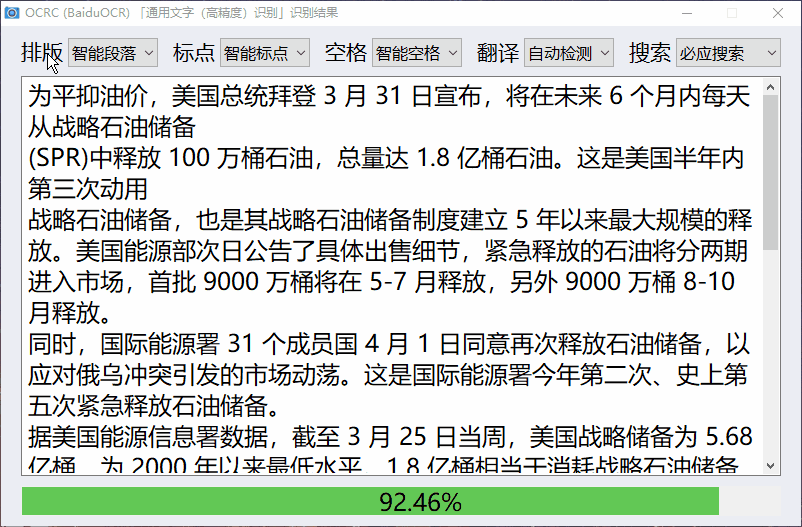

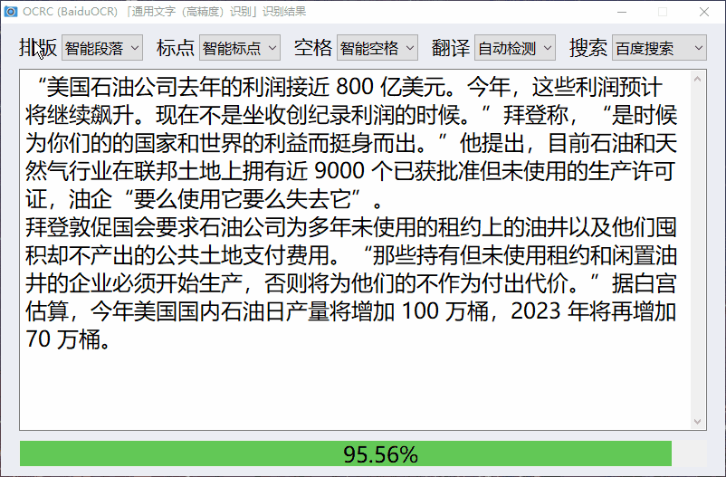

在使用「智能段落」重置后，原始结果选项跳转到了经过对方操作的结果。

---

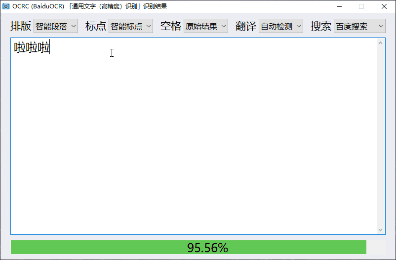

在编辑框可以自由操作，剪贴板会时刻记录最新的内容。

---

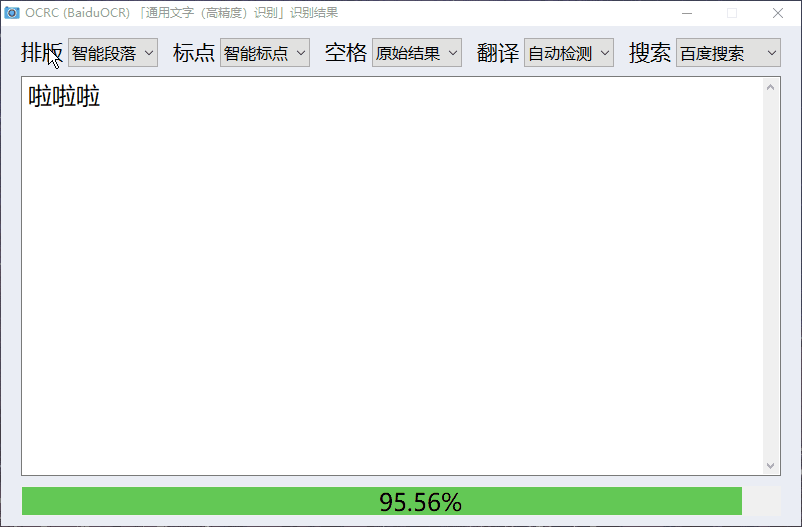

另一个说明「智能段落」的重置功能的例子。

---

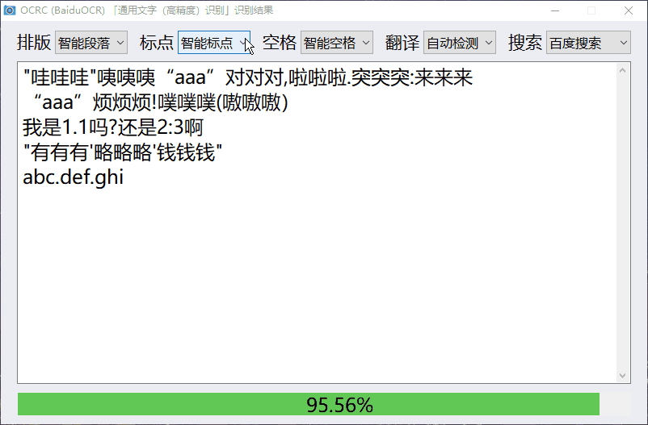

智能标点 + 智能空格演示。

---

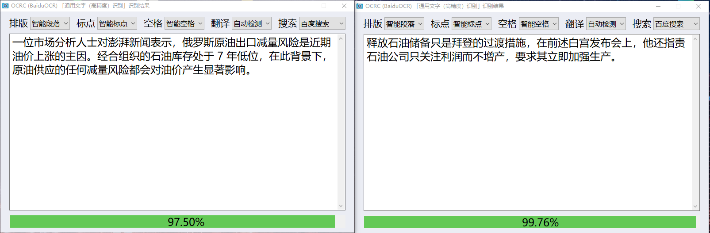

支持多窗口。

---

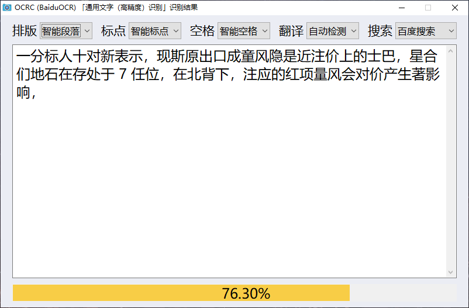

> 一位市场分析人士对澎湃新闻表示，俄罗斯原油出口减量风险是近期油价上涨的主因。经合组织的石油库存处于7年低位，在此背景下，原油供应的任何减量风险都会对油价产生显著影响。

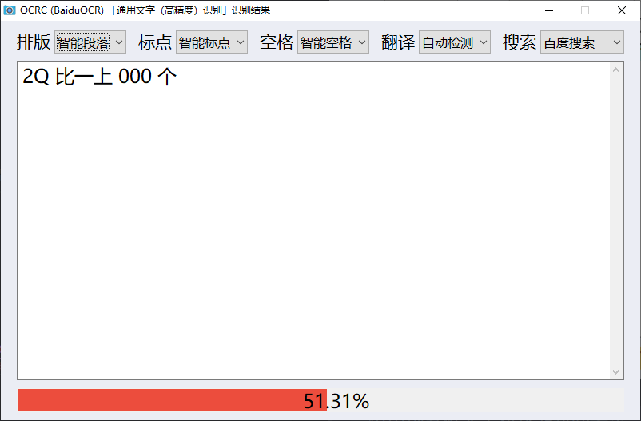

这是缩放文字进行处理的结果。置信度在 80% 以上置信度条是绿色的，60% ~ 80% 是黄色的，60% 以下是红色的。

实际上相同置信度 Mathpix 返回的结果远比百度准确，因此两个设置的阈值不同。（这红色的识别什么玩意还有 50% 置信度）

#### Mathpix OCR

以[ 维基百科 - 泰勒级数 ](https://zh.wikipedia.org/wiki/%E6%B3%B0%E5%8B%92%E7%BA%A7%E6%95%B0)为例进行演示。

**单条公式**

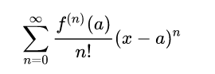

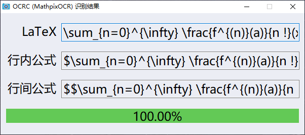

单条公式分为三条返回结果，分别为 *LaTeX*、*行内公式*与*行间公式*。最下面一条是置信度及其数值。

> **注意**：在 **1.1.3** 及以后的版本会返回 **4** 条结果，详细见下面。（本文撰至此处时的版本是 **1.1.2**，由于不影响说明便没有进行更改。

蓝色边框表明了正在选中该公式。

返回结果分别是

```LaTeX
\sum_{n=0}^{\infty} \frac{f^{(n)}(a)}{n !}(x-a)^{n}

$\sum_{n=0}^{\infty} \frac{f^{(n)}(a)}{n !}(x-a)^{n}$

$$
\sum_{n=0}^{\infty} \frac{f^{(n)}(a)}{n !}(x-a)^{n}
$$
```

可以看出来完美符合，置信度 100% 名副其实。

---

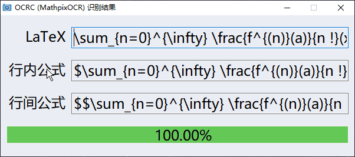

可以通过点选所需结果的编辑框来获取结果。

另外，编辑框是禁止编辑的。

---

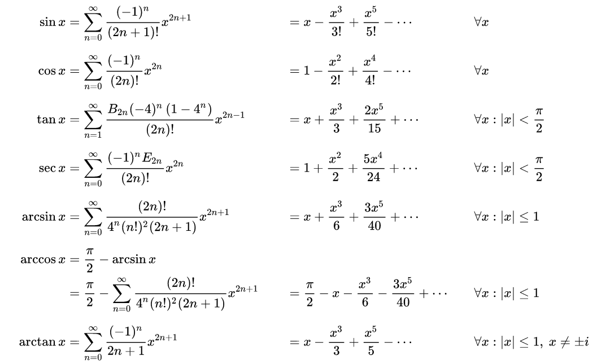

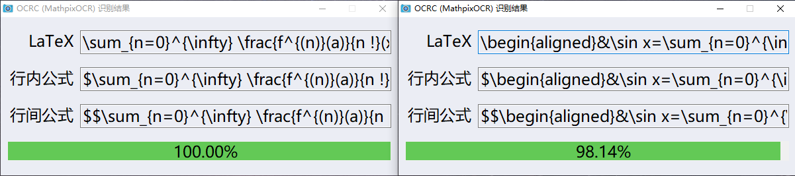

支持多窗口。

```LaTeX
$$
\begin{aligned}
&\sin x=\sum_{n=0}^{\infty} \frac{(-1)^{n}}{(2 n+1) !} x^{2 n+1}\\
&=x-\frac{x^{3}}{3 !}+\frac{x^{5}}{5 !}-\cdots\\
&\cos x=\sum_{n=0}^{\infty} \frac{(-1)^{n}}{(2 n) !} x^{2 n}\\
&=1-\frac{x^{2}}{2 !}+\frac{x^{4}}{4 !}-\cdots\\
&\tan x=\sum_{n=1}^{\infty} \frac{B_{2 n}(-4)^{n}\left(1-4^{n}\right)}{(2 n) !} x^{2 n-1} \quad=x+\frac{x^{3}}{3}+\frac{2 x^{5}}{15}+\cdots \quad \forall x:|x|<\frac{\pi}{2}\\
&\sec x=\sum_{n=0}^{\infty} \frac{(-1)^{n} E_{2 n}}{(2 n) !} x^{2 n} \quad=1+\frac{x^{2}}{2}+\frac{5 x^{4}}{24}+\cdots \quad \forall x:|x|<\frac{\pi}{2}\\
&\arcsin x=\sum_{n=0}^{\infty} \frac{(2 n) !}{4^{n}(n !)^{2}(2 n+1)} x^{2 n+1} \quad=x+\frac{x^{3}}{6}+\frac{3 x^{5}}{40}+\cdots \quad \forall x:|x| \leq 1\\
&\arccos x=\frac{\pi}{2}-\arcsin x\\
&=\frac{\pi}{2}-\sum_{n=0}^{\infty} \frac{(2 n) !}{4^{n}(n !)^{2}(2 n+1)} x^{2 n+1} \quad=\frac{\pi}{2}-x-\frac{x^{3}}{6}-\frac{3 x^{5}}{40}+\cdots \quad \forall x:|x| \leq 1\\
&\arctan x=\sum_{n=0}^{\infty} \frac{(-1)^{n}}{2 n+1} x^{2 n+1} \quad=x-\frac{x^{3}}{3}+\frac{x^{5}}{5}-\cdots \quad \forall x:|x| \leq 1, x \neq i
\end{aligned}
$$
```

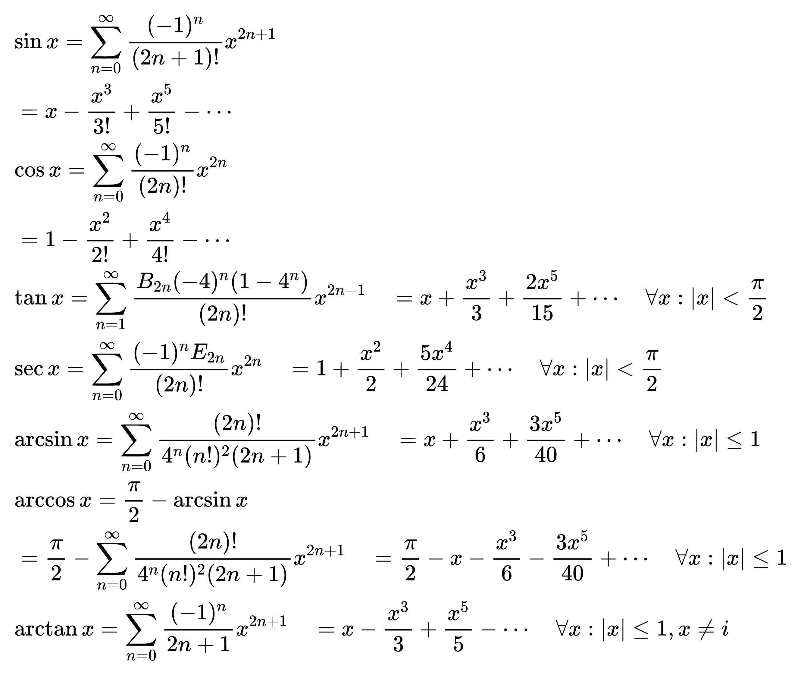

有一定的不足之处，但总体上还是可以接受的。

---

**单行文本 + 公式**

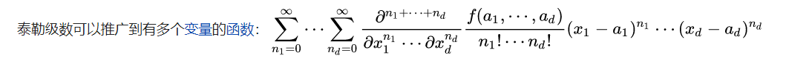

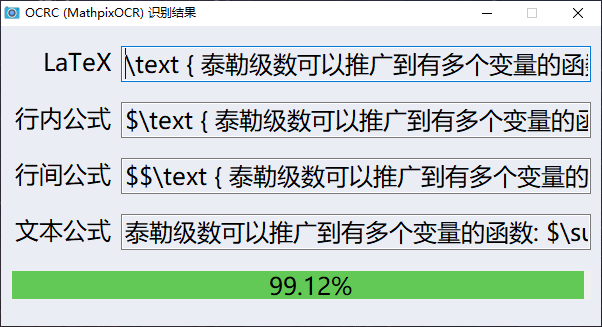

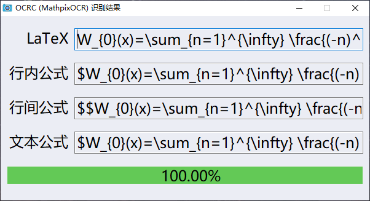

文本公式在单行文本与公式混搭时会返回更适用的结果。

---

**多行文本 + 公式**

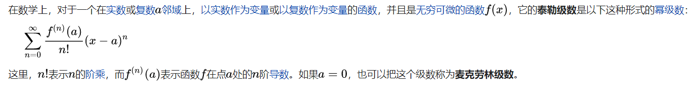

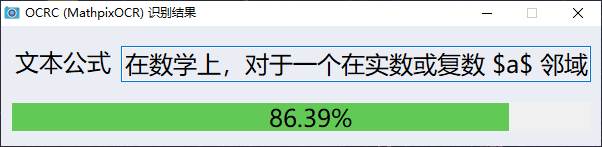

此时只会返回文本公式一个结果。

需要注意的是，这种情况的准确度并不稳定，同样文本刚刚 20% 的置信度再截图一次就 86% 了，因此如果不是很准确可以考虑多截几次图。

```LaTeX
在数学上，对于一个在实数或复数 $a$ 邻域上，以实数作为变量或以复数作为变量的函数，并且是无穷可微的函数 $f(x)$ ，它的泰勒级数是以下这种形式的幂级数:
$$
\sum_{n=0}^{\infty} \frac{f^{(n)}(a)}{n !}(x-a)^{n}
$$
这里， $n$ !表示 $n$ 的阶乘，而 $f^{(n)}(a)$ 表示函数 $f$ 在点 $a$ 处的 $n$ 阶导数。如果 $a=0$ ，也可以把这个级数称为麦克劳林级数。
```

除了有点遗憾没能将阶乘符号识别出来外，准确度极高。

---

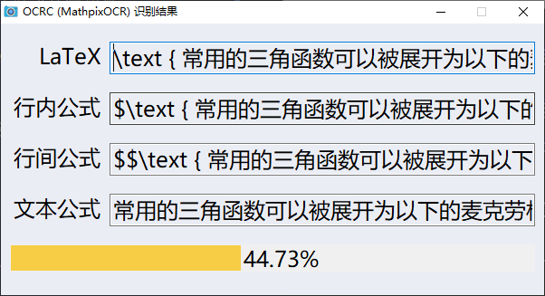

支持纯文本识别，但并不推荐。纯文本识别的工作还是交给百度比较好。

另外对于 Mathpix OCR，置信度在 60% 以上置信度条是绿色的，20% ~ 60% 是黄色的，20% 以下是红色的。

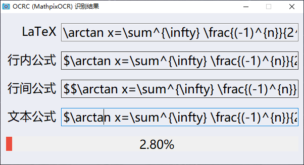

这是故意没截全的返回结果，实际上准确率挺不错的，还挺谦虚的。

### 错误 Error

在正常范围的操作内（不手动修改配置文件）除了 API 返回的错误外，是不会出现错误与错误信息的。修改配置文件的情况导致的错误并没有采取措施返回错误信息，因此不建议在不了解的情况下随意修改配置文件。

常见错误示例：

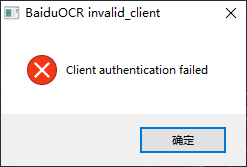

Secret_Key 不正确。

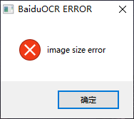

图片过大或过小。

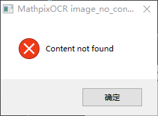

未识别到内容。

详细错误信息及相关解释见

|   OCR   | 类型  |                      网址                       |
| :-----: | :---: | :---------------------------------------------: |
|  百度   | Token | https://ai.baidu.com/ai-doc/REFERENCE/Ck3dwjhhu |
|  百度   | 识别  |   https://cloud.baidu.com/doc/OCR/s/dk3h7y5vr   |
| Mathpix | 识别  |   https://docs.mathpix.com/#error-id-strings    |

## 鸣谢 Thanks

按对我贡献大小升序排列。

### Quicker 动作 - 截图OCR

OCRC 的念头及百度 OCR 部分起源于 [Quicker] 动作 [截图OCR]。由于 Quicker 是付费的（虽然可以免费使用），就高仿做了一个。

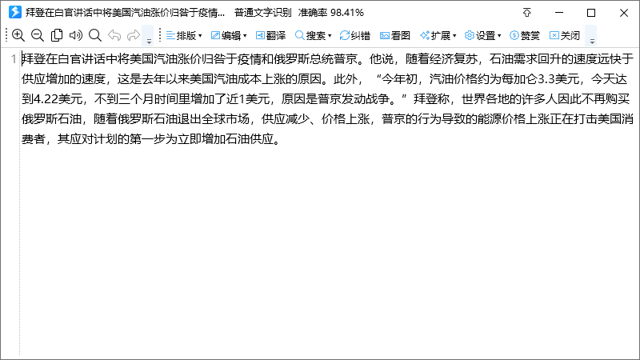

这个动作更美观一点。比起 OCRC 多了*行数*（暂时想不到解决方法）、*翻译*、*纠错*、*保存*、*文字大爆炸*、*内容审核*等功能。

实际上纠错、内容审核也可以做，只是百度给的 API 是总量限制的，再加上用处不大，也就没有弄了。*翻译*是很重要的功能，以后肯定要加入的。

[Quicker]: https://getquicker.net/

[截图OCR]: https://getquicker.net/Sharedaction?code=ba82e11a-f845-4ca3-44ee-08d690b5076c


### img2latex

OCRC 的 Mathpix 部分起源于 [GitHub](https://github.com/) 项目 [img2latex](https://github.com/blaisewang/img2latex-mathpix)，当时百度部分已基本完成，就高仿嵌了一个。

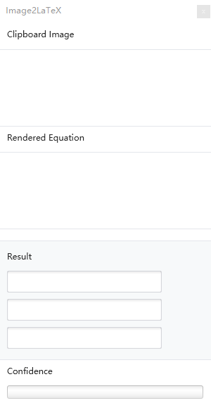

也是更美观一点。还支持*剪贴板图片显示*、*公式渲染*等功能。

剪贴板显示的功能应该不难，但我觉得没什么必要。公式渲染的功能不错，但是可能太困难了，再加上公式一大显示不清晰，就弃用了。

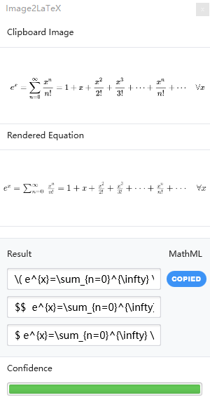

另外，置信度的颜色还是我从他们的源码上找到的。

```java
// red for less than 20% certainty, yellow for 20% ~ 60%, and green for above 60%
CONFIDENCE_PROGRESS_BAR.progressProperty().addListener((observable, oldValue, newValue) -> {
    var progress = newValue.doubleValue();
    if (progress < 0.2) {
        setStyle("-fx-accent: #ec4d3d;");
    } else if (progress < 0.6) {
        setStyle("-fx-accent: #f8cd46;");
    } else {
        setStyle("-fx-accent: #63c956;");
    }
});
```

本有考虑做渐变的置信度，但最终还是放弃了弄了个最简单的。

---

### AutoAHK - OCR

OCRC 的百度 OCR 部分是基于 [AutoAHK](https://www.autoahk.com/) 论坛的 [AHK 实现文字识别（OCR） —— 离线与在线4种方法总结](https://www.autoahk.com/archives/35526) 这篇文章改造的。不过已经改得面目全非，已然没了最初的模样。（截图工具内自带，如有需要可自行参考并加入）

> 附带一句，我并不是很喜欢这个论坛。因为一进这个论坛就提示我要登录，登录完就提示我要绑定邮箱，每个页面都是这样，还爆卡，我就用 uBlock Origin 禁了，这也让我对这里观感不好。

---

### [Stack Overflow](https://stackoverflow.com)

知名问答平台。

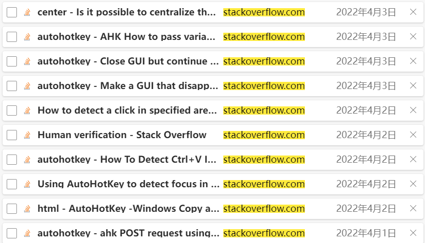

更多的没找到了。

---

### [百度智能云 API 文档](https://cloud.baidu.com/doc/OCR/s/Ek3h7xypm) & [Mathpix Reference](https://docs.mathpix.com)

参考文档。

---

### [AutoHotkey Community](https://www.autohotkey.com/boards/)

AutoHotkey 官方论坛可以说是对我帮助第二大的了。

例如 [How to change snapshots in clipboard to base64 directly?](https://www.autohotkey.com/boards/viewtopic.php?t=86814)

这个问题是 AutoHotkey 论坛第一个对我有帮助的问题。它最终形成了 `Common.ahk` 中的 `Img2Base` 函数。

```autohotkey
Img2Base(Front := False) {
	pToken := Gdip_Startup()
	pBitmap := Gdip_CreateBitmapFromClipboard()
	base64string := Gdip_EncodeBitmapTo64string(pBitmap, "JPG")
	Gdip_DisposeImage(pBitmap)
	Gdip_Shutdown(pToken)
	return Front ? "data:image/jpg;base64," base64string : base64string
}
```

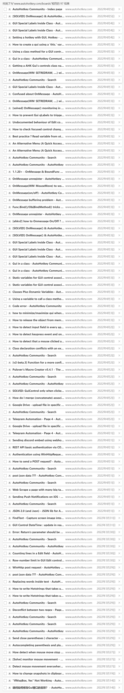

我的大部分教程里没找到答案的问题都是在这里解决的。

<Details><Summary>吐槽</Summary>

另外对比百度与必应国际对问题的搜索结果。（这些还不是很明显）


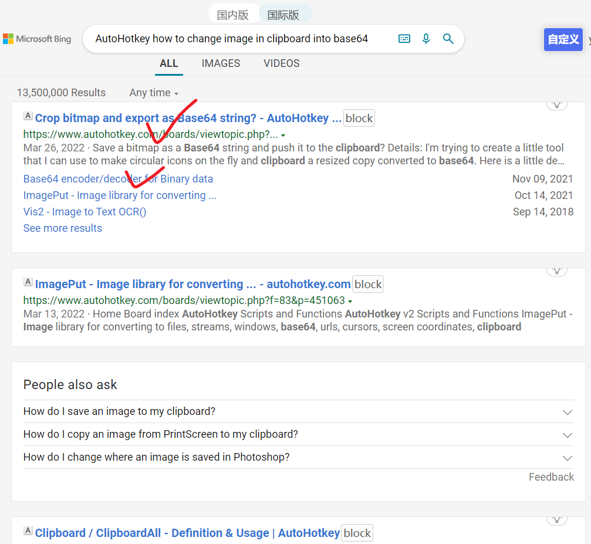


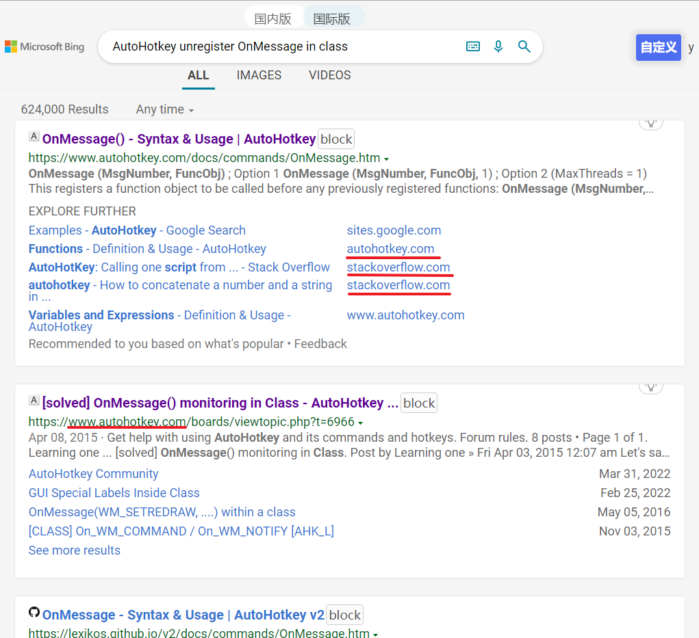

百度连 AutoHotkey 论坛都没出现。

</Details>

---

### [AutoHotkey 快速参考](https://wyagd001.github.io/zh-cn/docs/AutoHotkey.htm)

官方中文文档，给了我极大的帮助。

<Details><Summary>感悟</Summary>

## 感悟 Thoughts

印象中在此之前接触过一两次 AutoHotkey，但都只进行了简单的操作便放弃了。而这次再次接触后却一发不可收拾，我想也有网课的原因。虽然有点后悔，毕竟很快我就要开学，就要大寄了，不过好在摆脱了摆烂的深渊（虽然是从一个深渊到另一个深渊）。

AutoHotkey 这个语言我可谓是又爱又恨。爱它的简洁、易用，又恨它的不规范。举个例子

```autohotkey
array := ["a", "b"]
var := array[1]
%var% := array[2]
```

谁能想到这是定义一个变量 `a` 并将它赋值为 `"b"` 呢？而且数组的序号从 1 开始，简直就是异端！

```autohotkey
loop parse, result, "
{
    if Mod(A_Index, 2)
        PTR .= A_LoopField """"
    else
        PTR .= Trim(A_LoopField) """"
}

if focusvar in result,latex_result,inline_result,display_result
{
    GuiControlGet clipvar, , %hwnd%
    if clipvar {
        clipboard := ""
        clipboard := clipvar
    }
}
```

这两种写法对我这种强迫症简直不能忍，一定要写成

```autohotkey
loop parse, result, " {
    if Mod(A_Index, 2)
        PTR .= A_LoopField """"
    else
        PTR .= Trim(A_LoopField) """"
}

if focusvar in result, latex_result, inline_result, display_result {
    GuiControlGet clipvar, , %hwnd%
    if clipvar {
        clipboard := ""
        clipboard := clipvar
    }
}
```

然后就会报错了。对于大括号，在这个特殊的语法条件里大括号会被视为字符，导致错误。对于逗号的空格，也一样被视为字符。

还有关联数组的奇葩写法，这是因为以 `,` 等开头的才会并入前一行。

```autohotkey
√ array1 := {"a": 1, "b": 2, "c": 3}

√ array2 := {"a": 1
           , "b": 2
           , "c": 3}

× array3 := {
    "a": 1,
    "b": 2,
    "c": 3,
}
```

还有另类的就是 `\` 能正常使用，换行什么的从 `\n` 变为 `n 这样。

还有令我感慨万分的就是我写的第一个类（`Mathpix.ahk`），用的不是编程路上第一个语言 Python，不是我觉得很优雅的 JavaScript，而是这个「不伦不类」的 AutoHotkey。

不管怎样，AutoHotkey 都在我的编程路上留下了不可磨灭的印记，是一座值得仰望的丰碑。将来在这条路能否走得更远，就看返校后的我了:cry:。

</Details>

[^UnsupportHotkey]: [Hotkey 控件](https://wyagd001.github.io/zh-cn/docs/commands/GuiControls.htm#Hotkey)